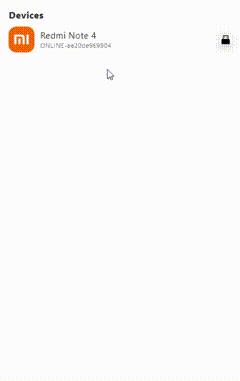
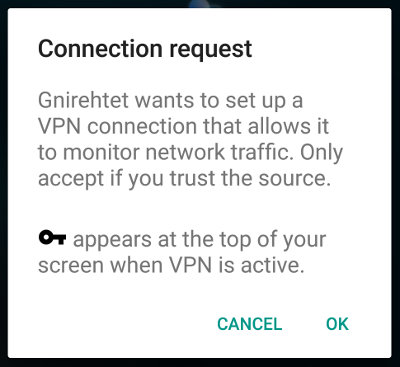

<h1 align="center">
  
   AGB 
</h1>

<h4 align="center">Reverse tethering for Android.</h4>
## Introduction

AGB is short for Android Great Bridge.It provides **reverse tethering** over `adb` for Android: it
allows devices to use the internet connection of the computer they are plugged
on. It does not require any _root_ access (neither on the device nor on the
computer). 

## Features

- **Fully stack support:** IPv4/IPv6/TCP/UDP
- **GUI support:** Beautiful and easy-to-use interface,bid farewell to the command line
- **Multiple devices:** Multiple devices can be connected at the same time
- **Multiple OS:** It works on _GNU/Linux_, _Windows_ and _Mac OS_.

## Requirements

The Android application requires at least API 23 (Android 6.0).

## Run (simple)

1、Turn on [developer options](https://www.digitaltrends.com/mobile/how-to-get-developer-options-on-android/) in the settings and
connect USB

2、Run AGB and click the button on the right

3、The very first start should open a popup to request permission

## Download
- [Windows](https://selfshare.shenqikeji.top/AGB/windows/agb.zip)
- [MacOS](https://selfshare.shenqikeji.top/AGB/macos/agb.zip)
- [Linux](https://selfshare.shenqikeji.top/AGB/linux/agb.zip)

## Stage

AGB is currently in its early stage and will support more functions soon.

## Donate

- *BTC:*  `1QGQKfCMEsZVsXuYHLutE1g9t3rf9o8o5F`
- *ETH:*  `0xa26414763ae2dd615bacdde142b5801f6a95e6e4`

