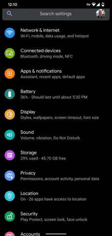
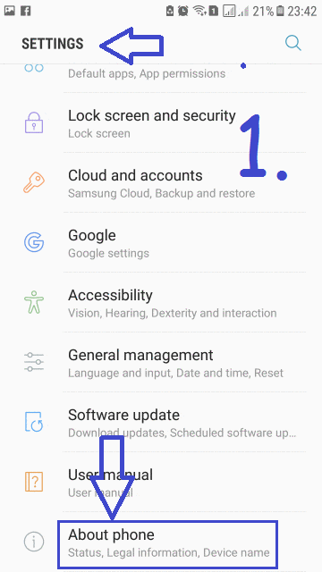
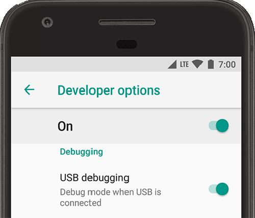

# 开启安卓的USB调试功能

## 为什么需要打开开发者选项 

安卓上的“设置”应用包含一个名为**开发者选项**的功能。手机需要打开该功能才能使用**USB调试**连接AGB。

**重要提醒**:部分设备例如部分小米手机需要把**允许USB安装、USB调试安全设置**一起也打开

## 打开步骤

### 步骤1

设置 > 系统 > 关于手机 > 版本号，点击**版本号**选项7次

 

### 步骤2

进入**开发者选项**页面，打开**USB调试**即可

* Android 9（API 级别 28）及更高版本：设置 > 系统 > 高级 > 开发者选项 > USB 调试
* Android 8.0.0（API 级别 26）和 Android 8.1.0（API 级别 26）：设置 > 系统 > 开发者选项 > USB 调试
* Android 7.1（API 级别 25）及更低版本：设置 > 开发者选项 > USB 调试

## FAQ

### 我还是找不到开发者选项?

每个牌子的手机开启开发者选项的步骤都略微不同，上文为大致通用步骤，如果仍然无法开启，请网上搜索对应品牌的开启步骤。

